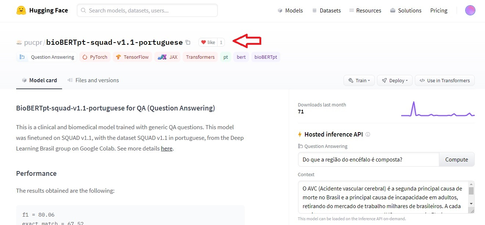
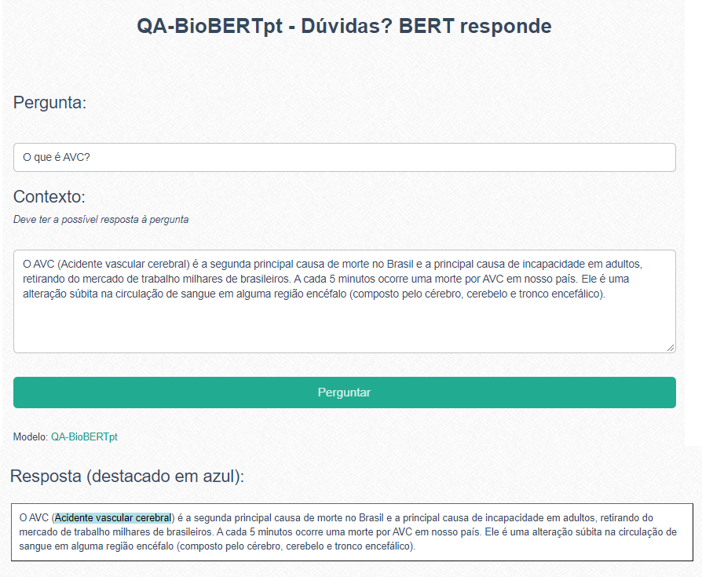
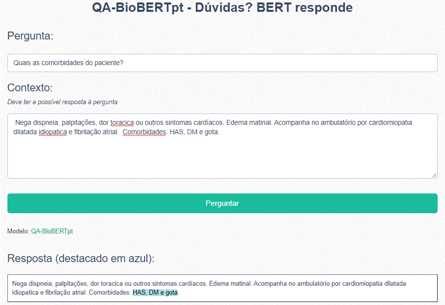

# QA-BioBERTpt 
## Dúvidas? BERT responde

** *trabalho em andamento* **

## Sobre

QA-BioBERTpt é um sistema de perguntas e respostas (Q&A - Questions and Answers) que utiliza um servidor ```flask``` em python e uma interface gráfica que recebe as perguntas do usuário. Juntamente com as perguntas, deve ser enviado um contexto que possua a resposta.

Para encontrar as respostas, é acessado o modelo [bioBERTpt-squad-v1.1-portuguese](https://huggingface.co/pucpr/bioBERTpt-squad-v1.1-portuguese), treinado com a [versão em português do squad v-1](https://medium.com/@pierre_guillou/nlp-modelo-de-question-answering-em-qualquer-idioma-baseado-no-bert-base-estudo-de-caso-em-12093d385e78), a partir do [BioBERTpt](https://github.com/HAILab-PUCPR/BioBERTpt).

O modelo está publicado no repositório do Hugging Faces, [neste endereço](https://huggingface.co/pucpr/bioBERTpt-squad-v1.1-portuguese). Se o modelo foi útil, nós adoraríamos receber um like ❤️



## Como executar 
1. Clone o repositório
2. Instale as biblitecas necessárias (se preferir, use [Anaconda](http://www.anaconda.com))
```
pip install transformers == 4.3.0
pip install flask == 4.3.0
```
ou através do comnando:
```
pip install -r requirements.txt
```
3. Execute o app.py (está configurado para rodar na porta 5000)
```
python app.py
```
4. No navegador, acesse http://localhost:5000/ (porta padrão do flask)

5. Escreve uma pergunta com seu devido contexto e clique no botão Perguntar. 
 
Será retornada à resposta prevista pelo modelo a sua pergunta. O primeiro acesso pode ser mais lento, já que o modelo e tokenizador serão baixados do repositório [HuggingFaces](https://huggingface.co/pucpr/bioBERTpt-squad-v1.1-portuguese).





**Output da API:**


Obtendo o modelo e tokenizador do repositório Hugging Faces


Formato da resposta

## Como citar

```
@InProceedings{10.1007/978-3-030-91699-2_10,
author="Oliveira, Lucas Emanuel Silva e.
and Schneider, Elisa Terumi Rubel
and Gumiel, Yohan Bonescki
and Luz, Mayara Aparecida Passaura da
and Paraiso, Emerson Cabrera
and Moro, Claudia",
editor="Britto, Andr{\'e}
and Valdivia Delgado, Karina",
title="Experiments on Portuguese Clinical Question Answering",
booktitle="Intelligent Systems",
year="2021",
publisher="Springer International Publishing",
address="Cham",
pages="133--145",
abstract="Question answering (QA) systems aim to answer human questions made in natural language. This type of functionality can be very useful in the most diverse application domains, such as the biomedical and clinical. Considering the clinical context, where we have a growing volume of information stored in electronic health records, answering questions about the patient status can improve the decision-making and optimize the patient care. In this work, we carried out the first experiments to develop a QA model for clinical texts in Portuguese. To overcome the lack of corpora for the required language and context, we used a transfer learning approach supported by pre-trained attention-based models from the Transformers library. We fine-tuned the BioBERTpt model with a translated version of the SQuAD dataset. The evaluation showed promising results when evaluated in different clinical scenarios, even without the application of a clinical QA corpus to support a training process. The developed model is publicly available to the scientific community.",
isbn="978-3-030-91699-2"
}
```
