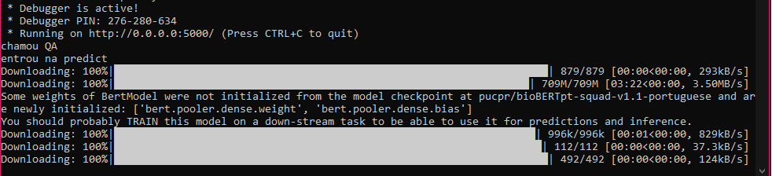
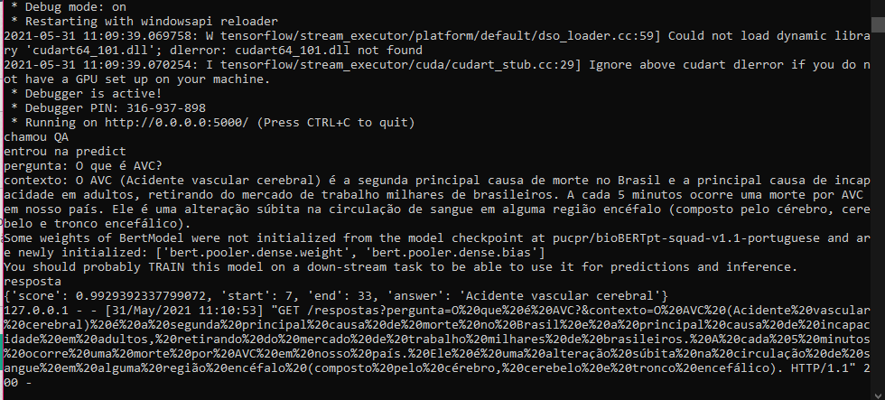

# QA-BioBERTpt 
## Dúvidas clínicas? BERT responde

** *trabalho em andamento* **

## Sobre

QA-BioBERTpt é um sistema de perguntas e respostas (Q&A - Questions and Answers) que utiliza um servidor flask em python e uma interface gráfica que recebe as perguntas do usuário. Juntamente com as perguntas, deve ser enviado um contexto que possua a resposta.

Para encontrar as respostas, é acessado o modelo [bioBERTpt-squad-v1.1-portuguese](https://huggingface.co/pucpr/bioBERTpt-squad-v1.1-portuguese), treinado com a [versão em português do squad v-1](https://medium.com/@pierre_guillou/nlp-modelo-de-question-answering-em-qualquer-idioma-baseado-no-bert-base-estudo-de-caso-em-12093d385e78), a partir do [BioBERTpt](https://github.com/HAILab-PUCPR/BioBERTpt).

## Como executar 
1. Clone o repositório
2. Instale as biblitecas necessárias (se preferir, use [Anaconda](http://www.anaconda.com))
```
pip install transformers == 4.3.0
pip install flask == 4.3.0
```
ou através do comnando:
```
pip install -r requirements.txt
```
3. Execute o app.py (está configurado para rodar na porta 5000)
```
python app.py
```
4. No navegador, acesse http://localhost:5000/ (porta padrão do flask)

5. Escreve uma pergunta com seu devido contexto e clique no botão Perguntar. 
 
Será retornada à resposta prevista pelo modelo a sua pergunta. O primeiro acesso pode ser mais lento, já que o modelo e tokenizador serão baixados do repositório [HuggingFaces](https://huggingface.co/pucpr/bioBERTpt-squad-v1.1-portuguese).


Output da API:


Obtendo o modelo e tokenizador do repositório Hugging Faces


Formato da resposta

## Como citar

** *em breve* **
